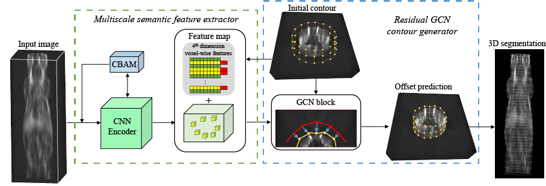
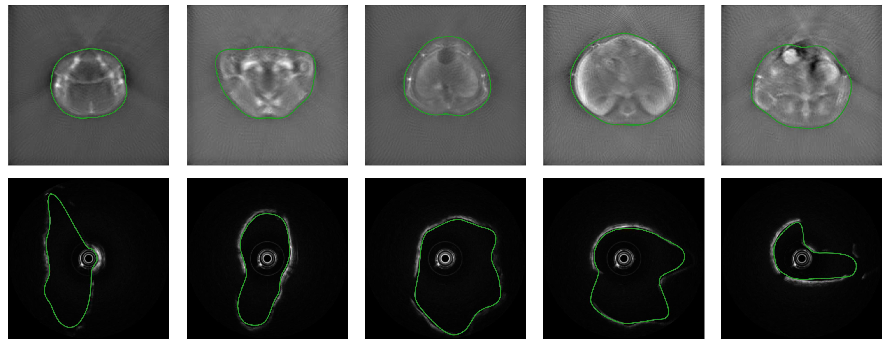

# CylinGCN: Cylindrical Structures Segmentation in 3D Biomedical Optical Imaging by a contour-based Graph Convolutional Network



> [CylinGCN: Cylindrical Structures Segmentation in 3D Biomedical Optical Imaging by a contour-based Graph Convolutional Network](https://arxiv.org/pdf/)  
>Zhichao Liang, Shuangyang Zhang, Anqi Wei, Zhenyang Liu, Yang Wang, Haoyu Hu, Wufan Chen, Li Qi

Any questions or discussions are welcomed!

## Installation

Please see [INSTALL.md](INSTALL.md).

## Testing

### Testing on PAT datasets
Test:
    ```
     python test.py --cfg_file configs/cylingcn_pat.yaml
    ```

### Testing on OCT datasets

Test:
    ```
    python test.py --cfg_file configs/cylingcn_oct.yaml
    ```
    

If setup correctly, the output will look like




## Training

The training parameters can be found in [project_structure.md](project_structure.md).

### Training on PAT datasets

```
python train.py --cfg_file configs/cylingcn_pat.yaml
```

### Training on OCT datasets

```
python train.py --cfg_file configs/cylingcn_oct.yaml
```

## Acknowledgement
This code is based on [Deep Snake](https://github.com/zju3dv/snake), thanks to their great contribution.


## Citation

If you find this code useful for your research, please use the following BibTeX entry.

```
@article{Liang2022,
  title={CylinGCN: Cylindrical Structures Segmentation in 3D Biomedical Optical Imaging by a contour-based Graph Convolutional Network},
  author = {Zhichao Liang and Shuangyang Zhang and Anqi Wei and Zhenyang Liu and Yang Wang and Haoyu Hu and Wufan Chen and Li Qi},
  journal = {Computerized Medical Imaging and Graphics},
  volume = {111},
  pages = {102316},
  year = {2024},
  issn = {0895-6111}  
}
```
